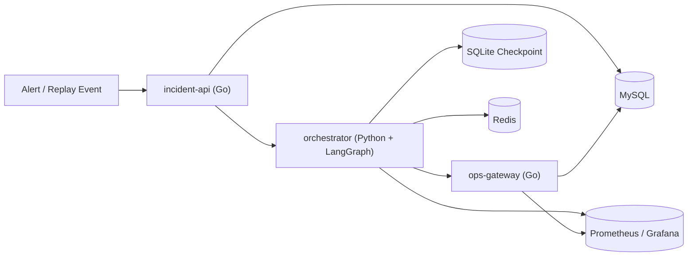
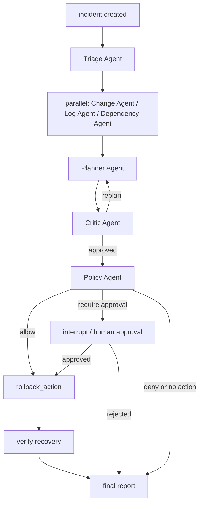

# GraphOps

面向线上发布后故障定位与应急处置场景的多 Agent 运维系统。项目采用 `Go + LangGraph` 分层架构：Go 负责 incident、审批、执行回执与持久化等业务真相，LangGraph 负责编排多 Agent 并行取证、诊断规划、人工审批中断恢复和最终报告生成。

当前版本围绕两类高频场景构建：

- 发布配置/版本回归导致的 5xx 飙升
- 下游依赖异常传播导致的主服务超时与报错

系统目标不是替代人工值班，而是把告警触发后的第一轮诊断和安全处置链路结构化，并对高风险动作加入明确的审批、幂等和恢复验证机制。

## 主要能力

- `Go + LangGraph` 分层架构
  - `incident-api` 维护 incident 生命周期、审批与报告查询
  - `ops-gateway` 暴露只读工具接口、执行回滚与恢复验证
  - `orchestrator` 使用 LangGraph 编排多 Agent 工作流
- 多 Agent 并行取证
  - `Change Agent`、`Log Agent`、`Dependency Agent` 作为三条并行取证分支分别采集变更、日志与依赖链证据
  - `Planner Agent` 在三类证据汇合后生成根因假设与处置方案
  - `Critic Agent` 审查方案并支持一次 replan
  - `Policy Agent` 评估动作风险并决定是否进入审批
- 人在回路的安全执行
  - LangGraph `interrupt + checkpoint`
  - 人工审批后恢复执行
  - `rollback` 幂等控制
  - 自动恢复验证与报告生成
- 结构化诊断数据模型
  - `Evidence`
  - `Hypothesis`
  - `ActionPlan`
  - `ActionReceipt`
  - `FinalReport`
- 可观测与运行保护
  - Redis 运行锁与回滚幂等键
  - `/metrics` 暴露 Prometheus 指标
  - Grafana 自动加载数据源与 dashboard
- 回放与评测
  - 支持 36 个场景样本 replay
  - 输出动作准确率、误回滚率、恢复率与延迟指标

## 整体架构



### 服务职责

#### `incident-api`

- 创建和查询 incident
- 审批通过/拒绝
- 保存分析结果与最终报告
- 记录事件时间线与 agent run 审计信息

#### `ops-gateway`

- 查询变更、日志、依赖关系
- 执行回滚动作
- 查询恢复验证结果
- 使用 Redis 保存最小幂等键
- 暴露 Prometheus 指标

#### `orchestrator`

- 加载 incident 上下文
- 执行多 Agent 并行取证
- 触发 `Planner -> Critic -> Policy` 协作链
- 在审批节点 `interrupt`
- 审批后继续执行回滚、验证与报告生成
- 暴露 Prometheus 指标

## Multi-Agent 工作流



在编排上，`Change Agent`、`Log Agent`、`Dependency Agent` 从 `Triage Agent` 后并行展开，完成三类证据采集后再汇合到 `Planner Agent`。`Planner Agent` 负责统一吸收并行分支产出的结构化证据，并继续交给 `Critic Agent` 和 `Policy Agent` 完成方案审查与动作决策。

### Agent 说明

当前代码中已经实现的 Agent 角色如下：

- `Triage Agent`
  - 判断是否进入发布后故障工作流
  - 识别 incident 类型
- `Change Agent`
  - 从工具结果中提取结构化变更证据
- `Log Agent`
  - 归纳错误模式与高频异常
- `Dependency Agent`
  - 分析是否为下游依赖传播
- `Planner Agent`
  - 结合证据生成 `Hypothesis + ActionPlan`
- `Critic Agent`
  - 审查证据是否充分，必要时触发一次 replanning
- `Policy Agent`
  - 将动作映射为 `allow / require_human_approval / deny`
- `Report Agent`
  - 输出最终诊断报告

下列节点属于工作流控制或执行环节，不单独视为 Agent：

- `approval_gate`
- `rollback_action`
- `verify_recovery`
- `load_incident`

## 持久化与状态边界

项目把状态分成三层：

- 业务真相
  - MySQL 中的 `incidents / approvals / evidence_items / action_receipts / incident_events / agent_runs`
- 编排状态
  - LangGraph checkpoint，当前使用 SQLite
- 运行保护
  - Redis 中的 `runlock:incident:{id}` 与 `idemp:rollback:{incident_id}:{target_service}`

这种分层保证了工作流中断可恢复，同时不把 LangGraph state 直接作为业务数据库使用。

## Redis 用途

当前 Redis 只承担最必要的两类职责：

- `incident run lock`
  - 防止同一个 incident 被重复 `run()` / `resume()`
- `rollback` 幂等键
  - 先用 Redis 做快速防重，再由 MySQL 唯一键兜底

这部分设计保持最小职责，不承载业务真相。

## 可观测能力

项目采用 metrics-first 方案，服务直接暴露 `/metrics`。

### 关键指标

- `graph_node_duration_seconds`
- `tool_call_duration_seconds`
- `approval_wait_duration_seconds`
- `incident_runs_total`
- `llm_calls_total`
- `llm_duration_seconds`
- `rollback_requests_total`
- `recovery_verification_total`

### Dashboard

Grafana 自动加载两张看板：

- `GraphOps Incident Overview`
- `GraphOps Agent Runtime`

### 监控组件

- Prometheus: [http://127.0.0.1:9090](http://127.0.0.1:9090)
- Grafana: [http://127.0.0.1:3000](http://127.0.0.1:3000)
  - 用户名：`admin`
  - 密码：`admin`

## 运行环境

### 依赖

- Go `1.24+`
- Python `3.12+`
- PowerShell
- Docker Desktop
- 可选：本地 Ollama

### 本地模型

默认会从环境变量读取：

- `REASONER_PROVIDER`
- `OLLAMA_MODEL`
- `OLLAMA_BASE_URL`

如果只想验证编排链路、审批和回放逻辑，可以使用规则模式：

```powershell
$env:REASONER_PROVIDER="rules"
```

如果使用 Ollama，请根据本机资源选择合适的模型，例如：

```powershell
$env:REASONER_PROVIDER="ollama"
$env:OLLAMA_MODEL="qwen3:4b"
```

## 快速开始

### 1. 启动基础依赖

```powershell
docker compose up -d redis prometheus grafana
```

如果希望启用 MySQL：

```powershell
docker compose up -d mysql
```

### 2. 启动应用服务

规则模式：

```powershell
$env:REDIS_URL="redis://127.0.0.1:6379/0"
$env:REASONER_PROVIDER="rules"
.\scripts\dev.ps1
```

使用 MySQL：

```powershell
$env:REDIS_URL="redis://127.0.0.1:6379/0"
$env:REASONER_PROVIDER="rules"
.\scripts\dev.ps1 -UseMySQL
```

Ollama 模式：

```powershell
$env:REDIS_URL="redis://127.0.0.1:6379/0"
$env:REASONER_PROVIDER="ollama"
$env:OLLAMA_MODEL="qwen3:4b"
.\scripts\dev.ps1
```

启动成功后可访问：

- incident-api: `http://127.0.0.1:8082`
- ops-gateway: `http://127.0.0.1:8085`
- orchestrator: `http://127.0.0.1:8090`

## 回放场景

### 快速回放

同时跑主场景和副场景，并自动审批主场景回滚：

```powershell
$env:REASONER_PROVIDER="rules"
.\scripts\replay.ps1 -Scenario both -ApproveMain
```

### 单场景回放

```powershell
.\scripts\replay.ps1 -Scenario main -ApproveMain
.\scripts\replay.ps1 -Scenario secondary
```

## 批量评测

评测脚本内置 36 个样本：

- `release_config_regression_01 ~ 18`
- `downstream_inventory_outage_01 ~ 18`

运行方式：

```powershell
$env:REASONER_PROVIDER="rules"
.\scripts\eval.ps1 -ApproveRollback -OutputPath .\logs\eval-report.json
```

输出内容包括：

- `action_accuracy`
- `false_rollback_rate`
- `rollback_recovered_rate`
- `median_initial_latency_ms`
- `median_end_to_end_latency_ms`

## 测试

### Go

```powershell
go test ./...
```

### Python

```powershell
cd .\orchestrator
python -m pytest tests -q
```

## 目录结构

```text
.
├── cmd/
│   ├── incident-api/
│   └── ops-gateway/
├── internal/
│   ├── incidentapi/
│   └── opsgateway/
├── orchestrator/
│   ├── graphops_orchestrator/
│   └── tests/
├── sql/
│   └── migrations/
├── scripts/
├── prometheus/
├── grafana/
│   ├── dashboards/
│   └── provisioning/
└── compose.yaml
```

## 当前实现说明

系统当前围绕以下能力组织：

- 多 Agent 并行取证与协作诊断
- 人工审批中断恢复
- 幂等回滚与恢复验证
- Redis 最小运行保护
- 可观测指标与 Grafana 看板
- 场景回放与批量评测

在此基础上，可以继续扩展更丰富的工具接入、更复杂的 incident 类型和更细粒度的评测集。
