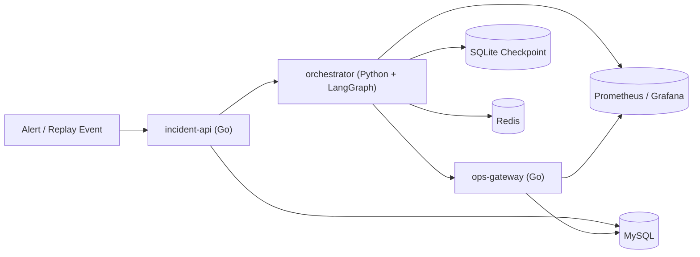
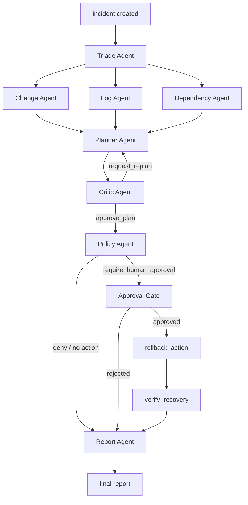

# GraphOps

RAG ?????? 是一个面向发布后故障定位与应急处置的多 Agent 运维系统，聚焦一个高频且适合打通闭环的场景：

- 发布配置/版本回归导致 `5xx` 飙升

项目采用 `Go + LangGraph` 分层架构：

- `Go` 负责 incident 生命周期、审批、执行回执、审计与持久化
- `LangGraph` 负责多 Agent 并行取证、诊断规划、审批中断恢复、回滚执行与最终报告生成

系统目标不是替代人工值班，而是把告警触发后的第一轮诊断链路结构化，把“取证、判断、审批、回滚、验证、报告”组织成一条可恢复、可审计、可观测的工作流。

## 核心能力

- 多 Agent 协作诊断
  - `Triage Agent` 识别是否进入发布后故障工作流
  - `Change Agent`、`Log Agent`、`Dependency Agent` 三个主分支并行取证
  - `Planner Agent` 汇总证据并生成根因假设与回滚计划
  - `Critic Agent` 复核证据充分性，必要时触发一次 replan
  - `Policy Agent` 根据风险决定是否进入人工审批
  - `Report Agent` 输出最终诊断报告
- LangGraph 编排
  - 三个主并行分支在同一张图里汇合
  - 支持 `interrupt / resume`
  - 支持 checkpoint 持久化与中断恢复
- 安全处置闭环
  - 高风险写操作默认进入审批
  - 回滚请求带幂等键
  - 回滚后自动执行恢复验证
- 可观测性
  - Prometheus 指标
  - Grafana 看板
  - incident 事件时间线
  - agent run 审计
- 演示控制台
  - 单页 `/demo` 控制台
  - 实时指标、趋势、人工审批、历史报告查询

## 为什么强调多 Agent

RAG ?????? 的核心不是“让一个模型回答问题”，而是把一次线上故障拆成多个职责清晰、可并行、可审计的 Agent 协作过程。

在主场景里，三个主并行 Agent 分别回答三个不同问题：

- `Change Agent`
  - 最近一次发布改了什么
  - 是否存在配置、版本、连接参数变化
  - 当前版本和回滚目标版本是什么
- `Log Agent`
  - 错误是否集中在本服务
  - 是否出现数据库连接、认证、配置不匹配等局部异常模式
  - 错误与发布时间是否强相关
- `Dependency Agent`
  - 下游依赖是否健康
  - 是否存在错误放大
  - 故障是否主要由依赖传播导致

这三个分支并行执行，先各自产生结构化证据，再汇总到 `Planner Agent`。这样的拆分既符合真实值班场景，也让工作流更容易解释、验证和审计。

## 架构



### 服务职责

#### `incident-api`

- 创建和查询 incident
- 持久化 incident 上下文
- 审批通过/拒绝
- 保存分析结果与最终报告
- 查询事件时间线与 agent run 审计

#### `ops-gateway`

- 暴露只读工具接口
- 暴露回滚动作接口
- 暴露恢复验证接口
- 承载回滚幂等控制
- 暴露 Prometheus 指标

#### `orchestrator`

- 加载 incident 上下文
- 执行多 Agent 编排
- 处理并行分支汇合
- 在审批节点中断
- 审批后恢复执行回滚与验证
- 输出最终报告
- 暴露 Prometheus 指标

## LangGraph 工作流



### 编排特点

- 三个主取证 Agent 并行执行
- `Planner -> Critic -> Policy` 构成诊断与安全决策主链
- `approval_gate` 使用 LangGraph `interrupt`
- `resume` 在人工审批后恢复到图中断点继续执行
- checkpoint 状态与业务真相分离

## 结构化数据模型

### Incident 上下文

创建 incident 时会携带：

- `cluster`
- `namespace`
- `environment`
- `alert_name`
- `alert_started_at`
- `release_id`
- `release_version`
- `previous_version`
- `labels`

这些字段会贯穿整条工作流，供三个并行 Agent、回滚动作和恢复验证共同使用。

### 诊断结果

- `Evidence`
  - `evidence_id`
  - `source_type`
  - `source_ref`
  - `summary`
  - `confidence`
- `Hypothesis`
  - 根因假设
  - 证据引用
  - 置信度
- `ActionPlan`
  - `target_service`
  - `current_revision`
  - `target_revision`
  - `risk_level`
  - `evidence_ids`
  - `verification_policy`
  - `requires_approval`
- `ActionReceipt`
  - `executor`
  - `from_revision`
  - `to_revision`
  - `status`
  - `verification_status`
- `FinalReport`
  - `summary`
  - `root_cause`
  - `recommended_action`
  - `verification`

## 可观测性

项目采用 metrics-first 方案。`orchestrator` 与 `ops-gateway` 直接暴露 `/metrics`，Prometheus 抓取后由 Grafana 展示。

### 关键指标

- `graph_node_duration_seconds`
- `graph_interrupts_total`
- `graph_replans_total`
- `evidence_items_total`
- `tool_call_duration_seconds`
- `approval_wait_duration_seconds`
- `incident_runs_total`
- `llm_calls_total`
- `llm_duration_seconds`
- `rollback_requests_total`
- `recovery_verification_total`
- `audit_write_failures_total`

### 看板

- `GraphOps Incident Overview`
- `GraphOps Agent Runtime`

### 监控组件

- Prometheus: [http://127.0.0.1:9090](http://127.0.0.1:9090)
- Grafana: [http://127.0.0.1:3000](http://127.0.0.1:3000)
  - 用户名：`admin`
  - 密码：`admin`

## 多模型路由

RAG ?????? 支持将不同 Agent 路由到不同本地模型，以体现“轻量并行 + 主链路强推理”的设计。

默认配置：

- 主链路 `Triage / Planner / Critic / Policy / Report`
  - `qwen3:4b`
- 并行证据分支 `Change / Log / Dependency`
  - `qwen3:1.7b`

这种划分使得：

- 三个主并行 Agent 走更轻的子模型，降低并发成本
- 主决策链仍由更强的主模型负责
- 前端控制台可直接显示 provider、主模型、并行模型，以及每个 agent run 的实际模型名

## 演示控制台

项目内置一个前端控制台：

- [http://127.0.0.1:8082/demo](http://127.0.0.1:8082/demo)

控制台包含：

- 运行态总览
- 三个主并行 Agent 说明
- 指标拆解与趋势
- incident 快照
- evidence / report 展示
- agent timeline
- 人工审批按钮
- 最近一次联调摘要
- 历史报告查询

## API

### incident-api

- `POST /incidents`
- `GET /incidents`
- `GET /incidents/{id}`
- `GET /incidents/{id}/events`
- `GET /incidents/{id}/agent-runs`
- `POST /incidents/{id}/approve`
- `POST /incidents/{id}/reject`
- `GET /incidents/{id}/report`

### orchestrator

- `GET /healthz`
- `POST /runs/incidents/{incident_id}`
- `POST /runs/incidents/{incident_id}/resume`
- `GET /metrics`

### ops-gateway

- `POST /tools/changes/query`
- `POST /tools/logs/query`
- `POST /tools/dependency/query`
- `POST /actions/rollback`
- `POST /actions/verify`
- `GET /metrics`

## 持久化与状态边界

项目将状态分为三层：

- 业务真相
  - MySQL 中的 `incidents / approvals / evidence_items / action_receipts / incident_events / agent_runs`
- 编排状态
  - LangGraph checkpoint，当前使用 SQLite
- 运行保护
  - Redis 中的 `runlock:incident:{id}` 与 `idemp:rollback:{incident_id}:{target_service}`

这种分层保证：

- incident 可审计
- 编排可恢复
- 幂等保护不与业务真相耦合

## 运行环境

### 依赖

- Go `1.24+`
- Python `3.12+`
- PowerShell
- Docker Desktop
- 可选：本地 Ollama

### 推理模式

默认从环境变量读取：

- `REASONER_PROVIDER`
- `OLLAMA_MAIN_MODEL`
- `OLLAMA_PARALLEL_MODEL`
- `OLLAMA_BASE_URL`
- `OLLAMA_NUM_CTX`
- `OLLAMA_PARALLEL_NUM_CTX`

规则模式：

```powershell
$env:REASONER_PROVIDER="rules"
```

Ollama 模式：

```powershell
$env:REASONER_PROVIDER="ollama"
$env:OLLAMA_MAIN_MODEL="qwen3:4b"
$env:OLLAMA_PARALLEL_MODEL="qwen3:1.7b"
$env:OLLAMA_NUM_CTX="8192"
$env:OLLAMA_PARALLEL_NUM_CTX="8192"
```

## 快速开始

### 1. 启动基础依赖

```powershell
docker compose up -d redis prometheus grafana
```

如需启用 MySQL：

```powershell
docker compose up -d mysql
```

### 2. 启动应用服务

规则模式：

```powershell
$env:REDIS_URL="redis://127.0.0.1:6379/0"
$env:REASONER_PROVIDER="rules"
.\scripts\dev.ps1
```

规则模式 + MySQL：

```powershell
$env:REDIS_URL="redis://127.0.0.1:6379/0"
$env:REASONER_PROVIDER="rules"
.\scripts\dev.ps1 -UseMySQL
```

Ollama 模式：

```powershell
$env:REDIS_URL="redis://127.0.0.1:6379/0"
$env:REASONER_PROVIDER="ollama"
$env:OLLAMA_MAIN_MODEL="qwen3:4b"
$env:OLLAMA_PARALLEL_MODEL="qwen3:1.7b"
$env:OLLAMA_NUM_CTX="8192"
$env:OLLAMA_PARALLEL_NUM_CTX="8192"
.\scripts\dev.ps1 -UseMySQL
```

启动成功后可访问：

- incident-api: `http://127.0.0.1:8082`
- ops-gateway: `http://127.0.0.1:8085`
- orchestrator: `http://127.0.0.1:8090`
- demo console: `http://127.0.0.1:8082/demo`

## 回放

### 主场景回放

```powershell
$env:REASONER_PROVIDER="rules"
.\scripts\replay.ps1 -ApproveRollback
```

### 指定变体

```powershell
.\scripts\replay.ps1 -VariantIndex 12 -ApproveRollback
```

## 批量评测

评测脚本内置 `18` 个发布回归变体样本：

- `release_config_regression_01 ~ 18`

运行方式：

```powershell
$env:REASONER_PROVIDER="rules"
.\scripts\eval.ps1 -ApproveRollback -OutputPath .\logs\eval-report.json
```

输出内容包括：

- `action_accuracy`
- `rollback_recovered_rate`
- `median_initial_latency_ms`
- `median_end_to_end_latency_ms`
- `waiting_for_approval_case_count`

## 测试

### Go

```powershell
go test ./...
```

### Python

```powershell
cd .\orchestrator
python -m pytest tests -q
```

## 目录结构

```text
.
├── cmd/
│   ├── incident-api/
│   └── ops-gateway/
├── internal/
│   ├── incidentapi/
│   └── opsgateway/
├── orchestrator/
│   ├── graphops_orchestrator/
│   └── tests/
├── sql/
│   └── migrations/
├── scripts/
├── prometheus/
├── grafana/
│   ├── dashboards/
│   └── provisioning/
└── compose.yaml
```

## 一句话概括

RAG ?????? 是一个围绕“发布后 5xx 飙升”场景构建的多 Agent 运维编排系统，核心是通过 `Change Agent / Log Agent / Dependency Agent` 三条主并行分支收集证据，再由 LangGraph 将诊断、审批、回滚、恢复验证和最终报告连接成一条可恢复、可审计、可观测的工作流。
