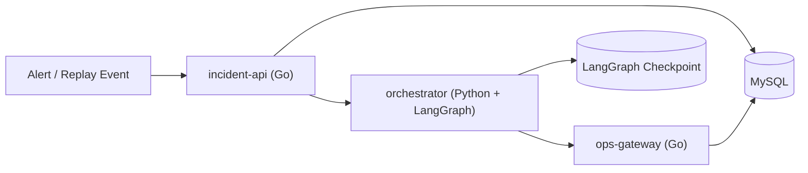
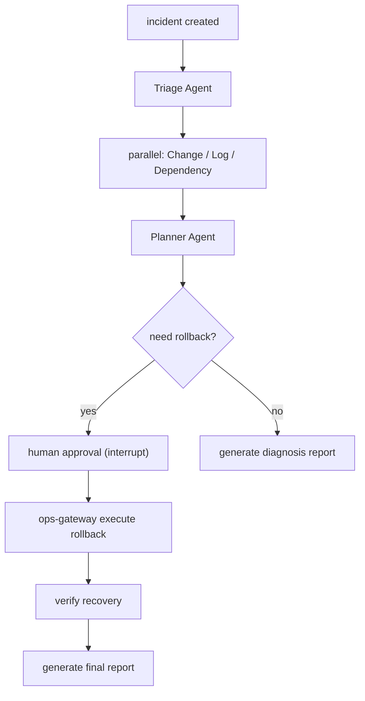

# GraphOps 设计方案

## 1. 项目概述

### 1.1 背景

在中大型互联网服务中，发布后故障是最常见也最具破坏性的一类线上问题。典型表现是某个服务在版本发布或配置变更后，短时间内出现 5xx 飙升、延迟抖动、调用链放大、下游资源耗尽等现象。值班同学通常需要在高压环境下同时查变更、翻日志、看依赖关系、判断是否回滚，这个过程高度依赖经验，且容易因为信息分散而导致判断变慢或误判。

GraphOps 的目标不是替代值班工程师做最终决策，而是把“告警触发后到形成首版诊断建议”这段最耗时、最容易漏信息的环节结构化，并把高风险动作纳入审批与幂等执行闭环。

### 1.2 项目目标

GraphOps 聚焦“发布后故障”的辅助诊断与安全回滚，目标如下：

1. 在告警触发后，自动并行收集变更、日志、依赖关系三类核心证据。
2. 生成带证据引用的根因假设与动作建议，而不是只输出自然语言结论。
3. 对高风险动作执行人工审批，避免模型直接触发写操作。
4. 在审批通过后，通过幂等执行器完成回滚，并自动验证恢复效果。
5. 保留完整的 incident、证据、审批、执行回执，方便后续复盘与经验沉淀。

### 1.3 非目标

当前版本不覆盖以下能力：

1. 通用 P0/P1 故障平台建设。
2. 自动处理所有类型的线上事故。
3. 直接接入生产环境执行不可回滚写操作。
4. 通用 GraphRAG、全链路 Trace 分析、复杂策略引擎。
5. 全量替代现有 SRE 平台、监控平台或变更平台。

---

## 2. 核心场景

### 2.1 主场景：发布后配置异常导致 5xx 飙升

#### 场景描述

`order-api` 在 2026 年 4 月 17 日 01:55 完成新版本发布。02:03 开始出现接口 5xx 比例上升、P95 延迟升高。值班同学收到告警后，需要快速判断：

1. 问题是否与最近发布直接相关。
2. 错误是否来自当前服务本身。
3. 是否应该回滚到上一个稳定版本。

#### 系统期望输出

GraphOps 在这个场景中完成如下闭环：

1. 接收告警并创建 incident。
2. 并行拉取最近发布与配置变更记录。
3. 并行聚合错误日志摘要，提取高频异常模式。
4. 并行查询当前服务的一跳依赖关系，判断问题是否可能来自下游。
5. 生成 Top-2 根因假设，并引用对应证据。
6. 输出候选动作 `rollback deployment`，附带审批理由。
7. 审批通过后执行回滚。
8. 验证 5xx 比例和 P95 延迟是否恢复。
9. 生成最终诊断报告。

### 2.2 副场景：下游依赖故障传导导致主服务报错

#### 场景描述

`inventory-service` 的下游数据库连接池耗尽，导致 `order-api` 在调用库存接口时出现超时和错误传播。表面上看是 `order-api` 5xx 升高，但根因并不在其最近发布。

#### 系统期望输出

GraphOps 在这个场景中完成如下能力：

1. 给出“更可能是下游依赖异常，而非当前服务发布问题”的判断。
2. 输出依赖传播链路相关证据。
3. 不自动给出回滚建议，转为人工排障或通知下游负责人。

主场景和副场景共同构成当前版本的边界：

1. 主场景支持诊断、审批、回滚、验证完整闭环。
2. 副场景只支持诊断闭环，不进入写操作执行。

---

## 3. 方案概览

### 3.1 总体思路

GraphOps 采用 `Go + LangGraph` 的分层架构：

1. `Go` 负责业务状态、HTTP API、审批接口、动作执行、幂等控制和持久化。
2. `LangGraph` 负责多 Agent 编排、并行采证、状态流转、审批暂停与恢复执行。

该设计的核心原则是：

1. 让 LLM 负责判断和规划，不直接拥有高风险写权限。
2. 让 Go 负责所有确定性执行和业务真相维护。
3. 让多 Agent 输出统一结构化证据，而不是自由文本堆叠。

### 3.2 总体架构



### 3.3 组件职责

#### `incident-api`（Go）

职责：

1. 接收告警并创建 incident。
2. 维护 incident 主状态。
3. 提供审批接口与报告查询接口。
4. 存储证据摘要、审批结果、动作回执和最终报告。

#### `ops-gateway`（Go）

职责：

1. 统一暴露只读工具接口：变更查询、日志查询、依赖关系查询。
2. 暴露一个高风险写接口：执行回滚。
3. 实现幂等控制和执行回执。
4. 提供恢复验证接口。

#### `orchestrator`（Python + LangGraph）

职责：

1. 管理多 Agent 工作流。
2. 并行采集结构化证据。
3. 融合证据并生成根因假设。
4. 在审批节点暂停，并在审批结果返回后恢复执行。

---

## 4. 为什么采用多 Agent

本项目采用多 Agent 的原因不是角色拟人化，而是证据源天然异构：

1. 变更证据关注的是“最近做了什么”。
2. 日志证据关注的是“当前错误长什么样”。
3. 依赖证据关注的是“故障影响链路如何传播”。

如果只用单 Agent 串行处理，会有两个问题：

1. 上下文容易混杂，模型可能把“最近有发布”误当成“发布必然是根因”。
2. 三类查询本身天然可并行，串行执行会增加首版诊断时延。

因此 GraphOps 把多 Agent 的价值明确限制在两点：

1. 并行获取不同证据。
2. 将不同证据在统一状态模型中融合。

---

## 5. Agent 设计

### 5.1 Agent 列表

#### `Triage Agent`

输入：

- 告警摘要
- 服务名
- 时间窗

职责：

1. 判断是否进入“发布后故障”工作流。
2. 提取服务名、时间范围、严重级别。
3. 初始化 incident 上下文。

#### `Change Agent`

输入：

- 服务名
- 时间窗

职责：

1. 查询最近 30 分钟到 2 小时内的发布记录与配置变更。
2. 提取与告警时间接近的变更证据。
3. 输出结构化变更证据。

#### `Log Agent`

输入：

- 服务名
- 时间窗

职责：

1. 查询错误日志摘要。
2. 提取高频异常模式。
3. 判断是否出现连接失败、超时、配置错误等典型特征。

#### `Dependency Agent`

输入：

- 服务名

职责：

1. 查询当前服务的一跳依赖关系。
2. 判断故障更可能发生在当前服务还是下游。
3. 输出简化 blast radius 结论。

#### `Planner Agent`

输入：

- 结构化变更证据
- 结构化日志证据
- 结构化依赖证据

职责：

1. 融合三类证据。
2. 生成 Top-2 根因假设。
3. 输出动作建议和审批理由。

### 5.2 工作流



### 5.3 LangGraph 在这里承担的能力

GraphOps 主要使用 LangGraph 的三个能力：

1. 并行分支，用于 Change、Log、Dependency 三路并发取证。
2. `interrupt`，用于高风险动作审批暂停。
3. checkpoint，用于审批后恢复和异常中断后的继续执行。

---

## 6. 核心状态模型

GraphOps 的工作流状态不是随意拼接的临时上下文，而是多 Agent 共享的运行时契约。

### 6.1 Graph State 字段

```text
incident_id
alert_summary
service_name
severity
change_evidence[]
log_evidence[]
dependency_evidence[]
hypotheses[]
proposed_action
approval_status
action_receipt
verification_result
final_report
```

### 6.2 三层状态边界

#### 业务状态

由 Go 维护：

1. incident 当前状态
2. 审批状态
3. 动作执行回执

#### 编排状态

由 LangGraph 维护：

1. 当前执行节点
2. 哪些并行分支已完成
3. 是否处于审批暂停态

#### 推理状态

由 graph state 传递：

1. 证据列表
2. 假设列表
3. 候选动作
4. 恢复验证结果

这种分层的目的是把“业务真相”和“LLM 推理上下文”解耦，避免把 LangGraph 状态直接当业务数据库使用。

---

## 7. 统一证据模型

GraphOps 的核心设计点不是接多少工具，而是把不同来源的数据统一成结构化证据，要求所有关键结论都能回溯到证据引用。

### 7.1 证据对象

```text
Evidence:
- evidence_id
- source_type        # change / log / dependency
- source_ref
- summary
- confidence
```

### 7.2 根因假设对象

```text
Hypothesis:
- hypothesis_id
- cause
- support_evidence_ids[]
- confidence
```

### 7.3 动作计划对象

```text
ActionPlan:
- action_type        # rollback
- target_service
- reason
- evidence_ids[]
- requires_approval
```

### 7.4 设计价值

统一证据模型的价值体现在 4 点：

1. 结论可追踪，便于复盘和人工校验。
2. Planner Agent 不需要直接消费原始日志，只处理结构化证据。
3. 能显式表达“证据不足”，而不是被动接受模型生成的结论。
4. 方便离线评估“结论是否有证据支撑”。

---

## 8. 执行闭环设计

### 8.1 设计原则

高风险动作必须满足以下原则：

1. LLM 只提议，不直接执行。
2. 执行前必须有审批结果。
3. 执行必须幂等。
4. 执行后必须有回执。
5. 回执必须参与恢复验证。

### 8.2 审批与执行流程

1. `Planner Agent` 输出 `ActionPlan`。
2. 如果动作类型为 `rollback`，LangGraph 进入 `interrupt`。
3. 值班同学通过 `incident-api` 进行审批。
4. 审批通过后，图恢复执行并调用 `ops-gateway` 的回滚接口。
5. `ops-gateway` 生成 `idempotency_key` 并执行动作。
6. 动作执行后写入 `action_receipt`。
7. `orchestrator` 调用验证接口判断恢复效果。

### 8.3 幂等回执模型

```text
ActionReceipt:
- receipt_id
- idempotency_key
- action_type
- target_service
- status
- executed_at
- verification_status
```

### 8.4 为什么这是关键设计点

这套设计把 LangGraph 的审批暂停能力和 Go 后端的确定性执行能力结合起来，解决了两个核心问题：

1. 避免模型直接触发高风险写操作。
2. 避免恢复执行或重试时重复执行副作用动作。

---

## 9. 数据建模

当前版本只保留 5 张核心业务表。

### 9.1 `incidents`

字段建议：

- `id`
- `service_name`
- `severity`
- `alert_summary`
- `status`
- `created_at`

### 9.2 `evidence_items`

字段建议：

- `id`
- `incident_id`
- `source_type`
- `summary`
- `source_ref`
- `confidence`
- `created_at`

### 9.3 `approvals`

字段建议：

- `id`
- `incident_id`
- `action_type`
- `status`
- `reviewer`
- `created_at`

### 9.4 `action_receipts`

字段建议：

- `id`
- `incident_id`
- `idempotency_key`
- `action_type`
- `status`
- `verification_status`
- `created_at`

### 9.5 `memory_cases`

字段建议：

- `id`
- `service_name`
- `incident_type`
- `summary`
- `action_taken`

### 9.6 数据落库原则

1. 原始日志不直接入业务库，只保存摘要和来源引用。
2. 原始变更明细由 `ops-gateway` 查询，业务库只存被采纳的证据摘要。
3. 依赖关系可通过静态样本表或 mock 数据提供，不要求当前版本构建完整服务图平台。

---

## 10. 接口设计

### 10.1 `incident-api`

- `POST /incidents`
- `GET /incidents/{id}`
- `POST /incidents/{id}/approve`
- `POST /incidents/{id}/reject`
- `GET /incidents/{id}/report`

### 10.2 `ops-gateway`

- `POST /tools/changes/query`
- `POST /tools/logs/query`
- `POST /tools/dependency/query`
- `POST /actions/rollback`
- `POST /actions/verify`

### 10.3 请求头约定

跨服务请求统一携带：

- `X-Incident-ID`
- `X-Request-ID`
- `X-Trace-ID`
- `Idempotency-Key`

这样可以保证请求链路可追踪，并为幂等执行提供统一标识。

---

## 11. 恢复验证设计

回滚执行后，系统不以“动作执行成功”作为结束条件，而以“业务指标恢复”作为结束条件。

### 11.1 当前版本验证指标

只保留两个验证指标：

1. 5xx 比例是否下降到阈值以下。
2. P95 延迟是否恢复到稳定区间。

### 11.2 验证结果分类

验证结果分为 3 类：

1. `recovered`：两项指标均恢复。
2. `partial_recovered`：仅一项恢复。
3. `not_recovered`：两项均未恢复。

### 11.3 主场景与副场景的区别

1. 主场景在审批通过后一定进入验证流程。
2. 副场景由于没有执行回滚，验证阶段只输出“当前未执行动作，建议人工处理”。

---

## 12. 安全性与可靠性设计

### 12.1 安全边界

1. 所有只读工具调用默认允许。
2. 所有高风险写操作必须人工审批。
3. LLM 不直接持有执行权限。
4. 所有动作执行都必须落回执。

### 12.2 可靠性策略

1. 回滚动作通过 `idempotency_key` 保证幂等。
2. LangGraph 使用 checkpoint 保证暂停后可恢复。
3. 工具查询失败时允许有限重试，但不在当前版本引入复杂消息队列。
4. 如果证据不足，Planner Agent 必须输出“不足以判断”，而不是强行生成回滚建议。

---

## 13. 评估方案

### 13.1 回放样本

准备 20 到 30 条故障回放样本，覆盖以下两类：

1. 发布后配置异常。
2. 下游依赖故障传导。

每条样本包含：

1. 告警摘要
2. 变更记录
3. 日志摘要
4. 依赖关系
5. 正确根因标签
6. 正确动作建议

### 13.2 评估指标

1. `Top-1 Root Cause Accuracy`
2. `Top-2 Root Cause Accuracy`
3. `Unsupported Claim Rate`
4. `Rollback Suggestion False Positive Rate`
5. `First Diagnosis Latency`

### 13.3 评估目标

当前版本更关注两个问题：

1. 系统是否能比人工更快给出首版诊断建议。
2. 系统是否能把错误的回滚建议控制在低水平。

---

## 14. 实施计划

### 阶段一：只读诊断闭环

交付内容：

1. `incident-api`
2. `ops-gateway`
3. `orchestrator`
4. Change / Log / Dependency 三个证据分支
5. Top-2 根因假设输出

### 阶段二：审批与回滚执行

交付内容：

1. `interrupt` 审批节点
2. 回滚执行接口
3. `idempotency_key`
4. `action_receipt`

### 阶段三：恢复验证与报告

交付内容：

1. 验证接口
2. 最终报告生成
3. 故障回放评估集
4. 指标统计

---

## 15. 关键设计取舍

### 15.1 为什么只保留三类证据源

因为发布后故障最强相关的信息通常就是：

1. 最近做了什么变更。
2. 当前报了什么错误。
3. 问题是本服务还是依赖传播。

这三类信息足够支撑主场景和副场景，且能形成清晰的多 Agent 边界。

### 15.2 为什么只支持一个高风险动作

因为当前版本的目标是把“审批 + 幂等执行 + 恢复验证”这条链路做实。与其支持多个动作但都很浅，不如把 `rollback` 一个动作做成可讲、可验证、可恢复的闭环。

### 15.3 为什么不把 LangGraph 当业务数据库

因为 LangGraph 更适合表达工作流运行状态，不适合作为 incident、审批、回执等业务真相的长期存储。业务状态由 Go 服务维护，编排状态由 LangGraph 维护，可以减少一致性问题和边界混乱。

---

## 16. 最终定位

GraphOps 是一个聚焦发布后故障的多 Agent 辅助诊断与安全回滚系统。它的核心不在于“接了多少工具”，而在于两点：

1. 通过统一证据模型，把多 Agent 的推理过程约束为可追踪、可验证的结构化过程。
2. 通过 `interrupt + 审批 + 幂等回执 + 恢复验证`，把高风险动作做成安全可恢复的执行闭环。

在当前版本中，主场景是“发布后配置异常导致 5xx 飙升”，副场景是“下游依赖故障传导导致主服务报错”。前者验证完整闭环，后者验证诊断边界，共同构成 GraphOps 的现实落地范围。
